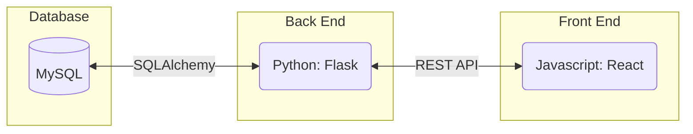
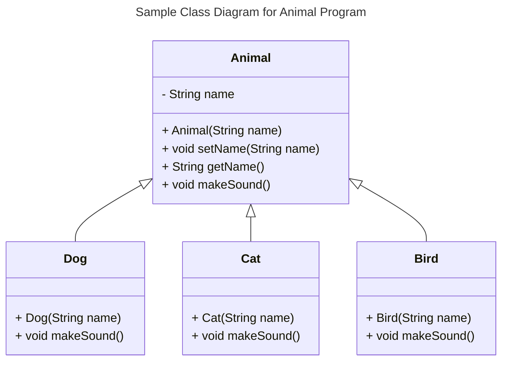
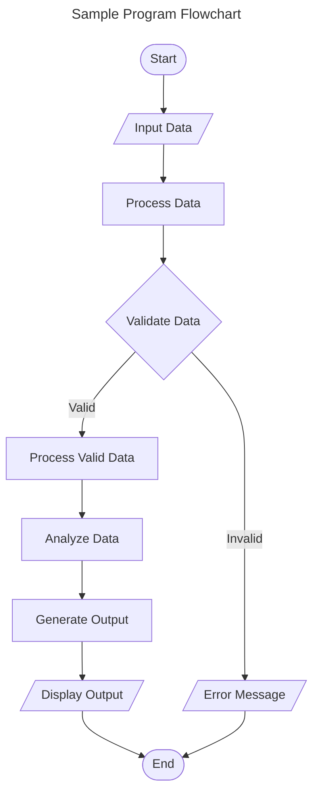
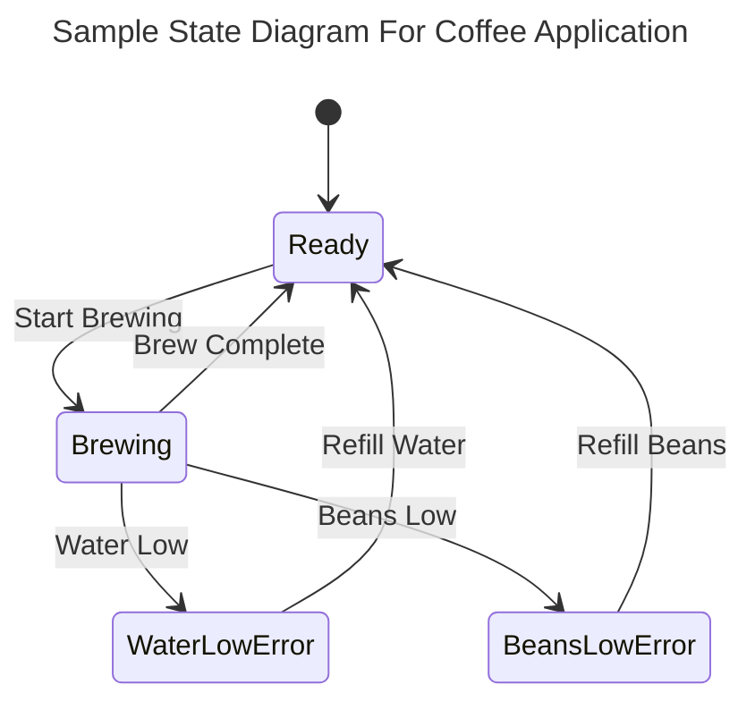
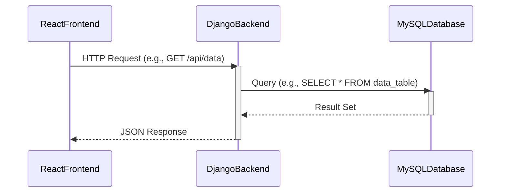

# Requirements and Specification Document

## TeamName

<!--The name of your team.-->

### Project Abstract

<!--A one paragraph summary of what the software will do.-->

geocaching app with added game element, with a focus on UW-Madison events/activities

Create an application to allow users to play “Buckymon Go!” This game would require users to go to various real world locations / events around the UW-Madison campus to earn points for capturing pictures (and possibly performing some mini-game task) at these locations / events. (Ideally, GPS would be used so that the users could capture/collect virtual things that exist only in proximity to the "target" coordinates. Another possibility: Use image analysis to automatically confirm that the picture they've taken corresponds to the objective.)

Users should earn points for achieving goals in the app and should have a saved library of all their accomplishments. The game should have a server that can service multiple users simultaneously.

Stretch: An interface where people holding events can enter a request to have a BG goal at their event; and a corresponding admin interface for processing those requests.

### Customer

<!--A brief description of the customer for this software, both in general (the population who might eventually use such a system) and specifically for this document (the customer(s) who informed this document). Every project will have a customer from the CS506 instructional staff. Requirements should not be derived simply from discussion among team members. Ideally your customer should not only talk to you about requirements but also be excited later in the semester to use the system.-->

### User Requirements

<!--This section lists the behavior that the users see. This information needs to be presented in a logical, organized fashion. It is most helpful if this section is organized in outline form: a bullet list of major topics (e.g., one for each kind of user, or each major piece of system functionality) each with some number of subtopics.-->

| ID   | Description                                                  | Priority | Status |
| ---- | ------------------------------------------------------------ | -------- | ------ |
| R11  | Users should have to sign into the system; their google acount should be used for identification. | Low - Med      | Open   |
| R12  | The user should be able to see a map of their sorrounding area with markers for nearby areas with activities. | High     | Open   |
| R13  | The user should be able to select a marker on map and be able to see the activity as well as directions to the marker. Directions should be verified from a few different locations from campus to verify directions. | High     | Open   |
| R14  | A full-time employee should not be able to submit a time card with less than 40 hours per week recorded. | High     | Open   |
| R15  | A user should be authenticated as having "Done" the activity with either geolocation proximity | High      | Open   |
| R16  | A user should be authenticated as having "Done" the activity with IMAGE analysis | Low      | Open   |
| R17  | Physically place certain minigames in these areas around campus for minigames | High     | Open   |
| R18  | A section or tab in the web app where users are able to see their past completed history | High     | Open   |
| R19  | A section or tab in the web app where users are able to see their past completed history | High     | Open   |
| R20  | Have the backend handle multiple users intereacting with the app at the same time | High     | Open   |
| R21  | Have the backend service scale with Kubernetes depending on the load | Low     | Open   |

<div align="center"><small><i>Excerpt from Crookshanks Table 2-2 showing example user requirements for a timekeeping system</i></small></div>

- You 
  - Can
    - Use
- Bullet
  - Points
    - In
    - Markdown

### Use Cases & User Stories

<!--Use cases and user stories that support the user requirements in the previous section. The use cases should be based off user stories. Every major scenario should be represented by a use case, and every use case should say something not already illustrated by the other use cases. Diagrams (such as sequence charts) are encouraged. Ask the customer what are the most important use cases to implement by the deadline. You can have a total ordering, or mark use cases with “must have,” “useful,” or “optional.” For each use case you may list one or more concrete acceptance tests (concrete scenarios that the customer will try to see if the use case is implemented).-->

Here is a sample user story from [Clean Agile](https://learning-oreilly-com.ezproxy.library.wisc.edu/library/view/clean-agile-back/9780135782002/ch03.xhtml#ch03lev1sec1) using a markdown block quote:

> As the driver of a car, in order to increase my velocity, I will press my foot harder on the accelerator pedal.

1. You
   1. Can
      1. Also
2. Use
   1. Numbered
      1. Lists

### User Interface Requirements

<!--Describes any customer user interface requirements including graphical user interface requirements as well as data exchange format requirements. This also should include necessary reporting and other forms of human readable input and output. This should focus on how the feature or product and user interact to create the desired workflow. Describing your intended interface as “easy” or “intuitive” will get you nowhere unless it is accompanied by details.-->

<!--NOTE: Please include illustrations or screenshots of what your user interface would look like -- even if they’re rough -- and interleave it with your description.-->

Images can be included with ``

### Security Requirements

<!--Discuss what security requirements are necessary and why. Are there privacy or confidentiality issues? Is your system vulnerable to denial-of-service attacks?-->

### System Requirements

<!--List here all of the external entities, other than users, on which your system will depend. For example, if your system inter-operates with sendmail, or if you will depend on Apache for the web server, or if you must target both Unix and Windows, list those requirements here. List also memory requirements, performance/speed requirements, data capacity requirements, if applicable.-->

| You    |    can    |    also |
| ------ | :-------: | ------: |
| change |    how    | columns |
| are    | justified |         |

### Specification

<!--A detailed specification of the system. UML, or other diagrams, such as finite automata, or other appropriate specification formalisms, are encouraged over natural language.-->

<!--Include sections, for example, illustrating the database architecture (with, for example, an ERD).-->

<!--Included below are some sample diagrams, including some example tech stack diagrams.-->

You can make headings at different levels by writing `# Heading` with the number of `#` corresponding to the heading level (e.g. `## h2`).

#### Technology Stack

Here are some sample technology stacks that you can use for inspiration:





#### Database

Database schema based on ER-Diagram (bold for primary key, italics for foreign key)

User(**user_id**, name, score)  
Achievements(**achievement_id**, a_name, a_description, a_score)  
Achieved(**user_id**, **achievement_id**)  
Events(**event_id**, _location_id_, e_name, e_score)  
Completed(**user_id**, **event_id**)  
Locations(**location_id** lat, long, l_name)


#### Class Diagram



#### Flowchart



#### Behavior



#### Sequence Diagram



## Standards & Conventions

### Variable Naming Convention 
- Variable Names: Are to be defined with snake case with lower case letters for example `let geolocation_from_user = 10;`
- Function Names: Are to follow the same snake case with _ seperator but the start of each word should be capitalized for example: `def Get_User_Info:`

### White Space / Line Length Convention
- Line Limit: Line length is not to exceed 80 charachters
- Whitespace Around Operators: Surround assignment(=) and boolean operators with one space on either side 
- Indentation: Use 4 spaces for Indentation
- Blank Lines: Use blank lines to separate logical blocks in methods
inspired by: "https://google.github.io/styleguide/pyguide.html"

### Comment Blocks
Write a big comment block at the start of each function in the following format:
```
/*
* What this function does
* What this function does
* Params and info about them
* Return value and how it is intended to be used
*/
```
The * character acts like a bullet point and this way we will be easily able to understand other people's functions in a black. box way.

If your function is long in length then adding smaller comment blocks at the start of each segment is highly recommended; for example:
```
function abc(x, y, z){
    //The code below gets image from the camera
    --------------
    --------------
    --------------
    --------------
    --------------

    //The segment handles moving the data to the DjangoBackend
    --------------
    --------------
    --------------
    --------------
    --------------

    //The final segment is responsible for moving the backend processed data to the ReactFrontend
    --------------
    --------------
    --------------
    --------------
    return value;
}
```

### Branch Naming Convention
When creating a new branch use the following convention, initial + forward slash + name of feauture. For example, `AA/GeolocationAPI` for user Agastya Asthana


<!--Here you can document your coding standards and conventions. This includes decisions about naming, style guides, etc.-->
